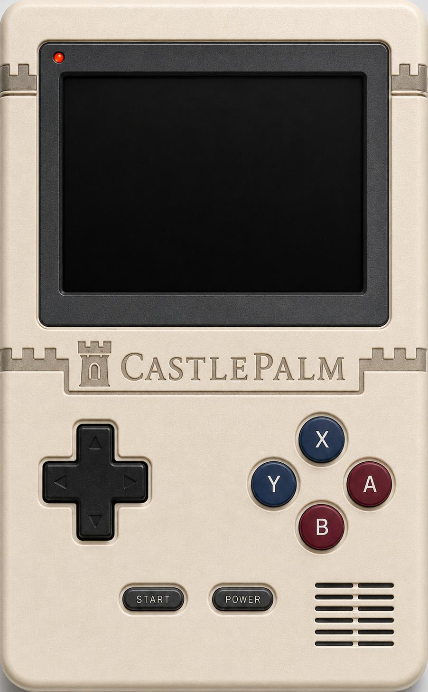

# CastlePalm SDK

Make games for **CastlePalm**, a fantasy 16-bit handheld console. Write a cart in
assembly, build a `.cpc`, and see it run — in seconds, with **no dependencies
beyond Node**.

<p align="center"></p>

▶ **Play in your browser:** **[Castle Arcade](https://castle-arcade.octonion.io/)** — and load your own `.cpc` with **Load cartridge…** or drag-and-drop.

## The console at a glance
- **320×224** screen, 4bpp tiles, two scrolling background layers, **128 sprites**
- SNES-style pad: **D-pad, A / B / X / Y, Start**
- 2 square + 1 noise audio channels
- **Deterministic:** the same input always produces the same frame (great for testing)

## Quickstart (under 5 minutes)

```sh
git clone https://github.com/EdwardAThomson/castlepalm-sdk
cd castlepalm-sdk
# no "npm install" needed — zero dependencies, just Node 18+
node tools/run.js examples/hello.asm 1 hello.png
```

Open **`hello.png`**: a white block in the middle of the screen. Now open
`examples/hello.asm`, change something, re-run, and watch it update. That's the
whole loop.

## Build a cartridge

```sh
node tools/build-cart.js examples/pong.asm pong.cpc PONG
```

Then play it interactively: open **`play.html`** in a browser and drag `pong.cpc`
onto the screen (or load it into Castle Arcade).

## Run / screenshot without a browser

```sh
node tools/run.js mygame.asm 60 shot.png --start
```

Builds the cart, runs 60 frames (tapping **Start** first to skip a title screen),
and saves a screenshot. Fast feedback while you iterate.

## What's in here

| Path | What |
| --- | --- |
| `examples/` | `hello.asm` (start here), plus `pong.asm`, `snake.asm`, `palmblast.asm` |
| `template/game.asm` | copy this to start a new cart |
| `tools/` | `build-cart` (.asm → .cpc), `run` (build + screenshot), `bundle`, `disasm` |
| `play.html` | a tiny browser shell to play a `.cpc` locally |
| `docs/` | the machine — read **`GOTCHAS.md` first** |

## Docs

- **[docs/GOTCHAS.md](docs/GOTCHAS.md)** — the handful of things that trip up newcomers. **Read this first.**
- [docs/CPU.md](docs/CPU.md) — registers, addressing, instruction set
- [docs/MMIO.md](docs/MMIO.md) — register map (input, video, audio)
- [docs/PPU.md](docs/PPU.md) — tiles, sprites, palette, layers
- [docs/MEMORY_MAP.md](docs/MEMORY_MAP.md) · [docs/SPEC.md](docs/SPEC.md) — overview & memory layout
- [cpu/ENCODING_V0.md](cpu/ENCODING_V0.md) — opcode encoding

## Your games are yours

The CastlePalm engine and SDK are **PolyForm-Noncommercial**, but the cartridges
you make with it are **yours**: you may distribute and **sell** them, and ship the
runtime so people can play. See [LICENSE.md](LICENSE.md) (the *Cartridge
Exception*). You own your game.
